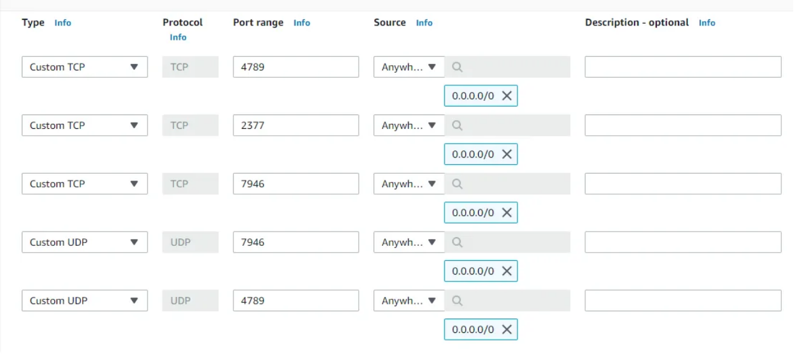

# PREREQUISTE

Create 2 EC2 instances with Docker installed in it.

Ensure Below ports are allowed

# Initializing Docker Swarm

Lets login to one EC2 instance and make it Swarm Leader by executing below command

`docker swarm init --advertise-addr $(hostname -i)`

Swarm initialized: current node (rzyy572arjko2w0j82zvjkc6u) is now a manager.

To add a worker to this swarm, run the following command:

`docker swarm join --token SWMTKN-1-69b2x1u2wtjdmot0oqxjw1r2d27f0lbmhfxhvj83chln1l6es5-37ykdpul0vylenefe2439cqpf 10.0.0.5:2377`

To add a manager to this swarm, run docker swarm join-token manager' and follow the instructions.

Login to the another EC2 instance and run the command shown in the output of command "docker swarm init..." run in the earlier EC2 instance.

Copy the entire "docker swarm join ..." command that is displayed as part of the output from your terminal output. Then, paste the copied command into the second terminal.

`docker swarm join --token SWMTKN-1-69b2x1u2wtjdmot0oqxjw1r2d27f0lbmhfxhvj83chln1l6es5-37ykdpul0vylenefe2439cqpf 10.0.0.5:2377`

Run the below command to verify that both nodes are part of the Swarm

`docker node ls`

# Create an overlay network

Create a new overlay network called “my-overlay” by running below command

`docker network create -d overlay overnet`

`docker network ls`

The other new networks (ingress and docker_gwbridge) were created automatically when the Swarm cluster was created

To view more detailed information about the “overnet” network. You will need to run this command from the first terminal.

`docker network inspect overnet`

# Creating a Docker Service in the swarm cluster

`docker service create --name myWebServer --network my-overlay -p 8090:80 --replicas 2 nginx:latest`

`docker service ps myWebServer`

`docker network inspect my-overlay`

# Test the network

To complete this step you will need the IP address of the service task running on node2.

Execute the following commands from the first terminal.

`docker network inspect my-overlay`

Notice that the IP address listed for the service task (container) running is different to the IP address for the service task running on the second node. Note also that they are on the same “overnet” network.

Run a docker ps command to get the ID of the service task so that you can log in to it in the next step.

`docker ps`

Log on to the service task. Be sure to use the container ID from your environment as it will be different from the example shown below. We can do this by running

`docker exec -it <CONTAINER ID> /bin/bash`

Install the ping command and ping the service task running on the second node.

`apt-get update && apt-get install -y iputils-ping`

`ping <node2 ip>`

# Test service discovery

Now that you have a working service using an overlay network, let’s test service discovery.

`docker exec -it yourcontainerid /bin/bash`

`cat /etc/resolv.conf`

Output : 

search ivaf2i2atqouppoxund0tvddsa.jx.internal.cloudapp.net
nameserver 127.0.0.11
options ndots:0

The value that we are interested in is the nameserver 127.0.0.11. This value sends all DNS queries from the container to an embedded DNS resolver running inside the container listening on 127.0.0.11:53. All Docker container run an embedded DNS server at this address

# Cleaning Up

Hopefully you were able to learn a little about how Docker Networking works during this lab. Lets clean up the service we created, the containers we started, and finally disable Swarm mode.

Remove Service :

`docker service rm myWebServer`

Execute the docker ps command to get a list of running containers.

`docker ps`

Finally, lets remove node1 and node2 from the Swarm

`docker swarm leave --force`